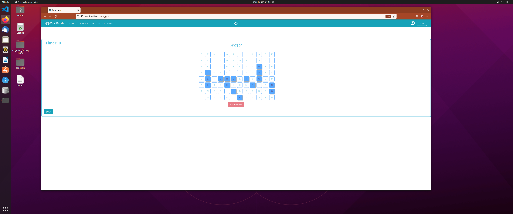

# Exam #5: "Crucipuzzle"
## Student:  INGLESE LUCIO ROCCO


## React Client Application Routes

- Route `/`: Hompage dell'applicazione. Nella prima fase è possibile scegliere se effettuare il login o entrare come host nell'applicazione (attraverso due pulsanti). Fatto questo è possibile scegliere la difficoltà(sempre attraverso i pulsanti).
- Route `/login`: Viene mostrato un semplice form da compilare per effettuare il login.
- Route `/hall_of_fame`: Viene mostrata attraverso una semplice tabella la classifica dei primi cinque player iscritti all'applicazione.
- Route `/grid`: Viene mostrata la griglia di lettere, realizzata attraverso i pulsanti (la dimensione dipende dalla difficoltà scelta prima dall'utente). Qui si svolgerà la partita.
- Route `/historyGame`: Viene mostrata una semplice tabella con la storia dei game fatti dall'utente.

## API Server

- GET `/api/classification`

 Restituisce un array di utenti con i relativi punteggi.

  Request URL: `http://localhost:3001/api/classification`

  Request Method: GET

  Request body: _None_

  Response:

  ```
  [{"point":155,"id_user":3,"name":"Valentina"},

  {"point":188,"id_user":2,"name":"Lucio"},

  {"point":220,"id_user":1,"name":"Giuseppe"}]

  ```
* * * * * * * * * * * * * * * * * * * * * * * * * * * * * * 

  -POST `/api/classification`

  inserisce un nuovo utente in classifica

  Request URL: `http://localhost:3001/api/classification`

  Request Method: POST

  Request body:

  ```
  {
	  "point": 200,
	  "id_user": 4,
	  "name": "Annalisa"
  }
  ```

  Response status: `201 ` 

* * * * * * * * * * * * * * * * * * * * * * * * * * * * * * 

- PUT `/api/classification`

  modifica il punteggio in basse all'id-user

  Request URL: `http://localhost:3001/api/classification`

  Request Method: PUT

  Request body:

  ```
  {
	  "point": 200,
	  "id_user": 4
  }
  ```

  Response status: `201 ` 


* * * * * * * * * * * * * * * * * * * * * * * * * * * * * * 
- GET `/api/games/:id_user`

  restituisce un array di games che soddisfano il filtro

  Request URL: `http://localhost:3001/api/games/2`

  Request Method: GET

  Request body: _None_

  Response:

  ```
  [{"id":6,"id_utente":2,"data":"19/01/2022","difficult":1,"point":4,"duration":15},

  {"id":7,"id_utente":2,"data":"19/01/2022","difficult":3,"point":36,"duration":60},

  {"id":8,"id_utente":2,"data":"19/01/2022","difficult":4,"point":48,"duration":60},

  {"id":9,"id_utente":2,"data":"19/01/2022","difficult":2,"point":20,"duration":60},  

  {"id":10,"id_utente":2,"data":"19/01/2022","difficult":5,"point":80,"duration":60}]
  ```
* * * * * * * * * * * * * * * * * * * * * * * * * * * * * * 

- POST `/api/game`
  modifica il punteggio in basse all'id-user

  Request URL: `http://localhost:3001/api/game`

  Request Method: POST

  Request body:

  ```
  {
	  "id_utente": 2,
	  "date": 02/02/2022,
    "difficult": 3,
	  "point": 30,
    "duration": 30,
	  "name": "Lucio"
  }
  ```

  Response status: `201 `  

* * * * * * * * * * * * * * * * * * * * * * * * * * * * * * 

- GET `/api/letter`

  restituisce un array di lettere con la relativa frequenza 

  Request URL: `http://localhost:3001/api/letter`

  Request Method: GET

  Request body: _None_

  Response:
  ```
  [{"lettera":"A","frequenza":8167},{"lettera":"B","frequenza":9659},{"lettera":"C","frequenza":12441},{"lettera":"D","frequenza":16694},{"lettera":"E","frequenza":29396},{"lettera":"F","frequenza":31624},{"lettera":"G","frequenza":33639},{"lettera":"H","frequenza":39733},{"lettera":"I","frequenza":46699},{"lettera":"J","frequenza":46852},{"lettera":"K","frequenza":47624},{"lettera":"L","frequenza":51649},{"lettera":"M","frequenza":54055},{"lettera":"N","frequenza":60804},{"lettera":"O","frequenza":68311},{"lettera":"P","frequenza":70240},{"lettera":"Q","frequenza":70335},{"lettera":"R","frequenza":76322},{"lettera":"S","frequenza":82649},{"lettera":"T","frequenza":91705},{"lettera":"U","frequenza":94463},{"lettera":"V","frequenza":95441},{"lettera":"W","frequenza":97801},{"lettera":"X","frequenza":97951},{"lettera":"Y","frequenza":99925},{"lettera":"Z","frequenza":100000}]
  ``` 


* * * * * * * * * * * * * * * * * * * * * * * * * * * * * * 

- GET `/api/word/:value`

  restituisce true se esiste la parola

  Request URL: `http://localhost:3001/api/word/ABEL`

  Request Method: GET

  Request body: _None_

  Response:
  ```
  true
  ```     


* * * * * * * * * * * * * * * * * * * * * * * * * * * * * * 


## Database Tables

- Table `UTENTE` - it contains: id name surname email password
   - Contiene i vari utenti cosi da permettere il login.
- Table `LETTERE` - it contains: id lettera frequenza
   - Contiene le lettere e la relativa frequenza. 
- Table `STORY_GAME ` - it contains: id id_utente creation_date difficolta game_duration punteggio name
   - Contiene tutti i game effettuati dagli utenti.
- Table `WORDS` - it contains: word 
   - Contiene le parole del dizionario inglese.
- Table `HALL_OF_FAME` - it contains: id punteggio id_user name
   - Contiene il punteggio totale degli utenti iscritti all'applicazione.

## Main React Components

- `Grids` (in `Grids.js`): lo scopo principale è quello di creare la griglia in base alla difficoltà scelta dall'utente. La griglia è composta da pulsanti ed è realizzata attravervo il componente `Celle`. Inoltre, è presente un timer, che misura il tempo di una partita. Sono presenti anche due pulsanti: `back`, per tornare nella hompage  (in questo caso il game non sarà salvato); e `stop game`, che permette di mettere in pausa o di abbandonare la partita(la partita sarà salvata).  
- `HistoryGame` (in `HistoryGame.js`): questo componente mostra lo storico delle partite dell'utente e viene realizzato attraverso il componente `Table`.


## Screenshot



## Users Credentials

- email : giusepperossi@gmail.com, password : giusepperossi. 
- email : luciorossi@gmail.com, password : luciorossi. 
- email : valentinarossi@gmail.com, password : valentinarossi. 


